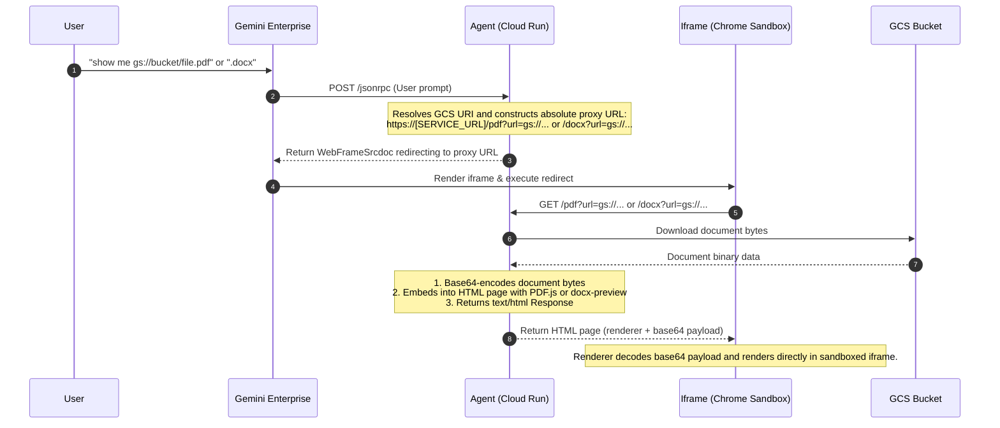
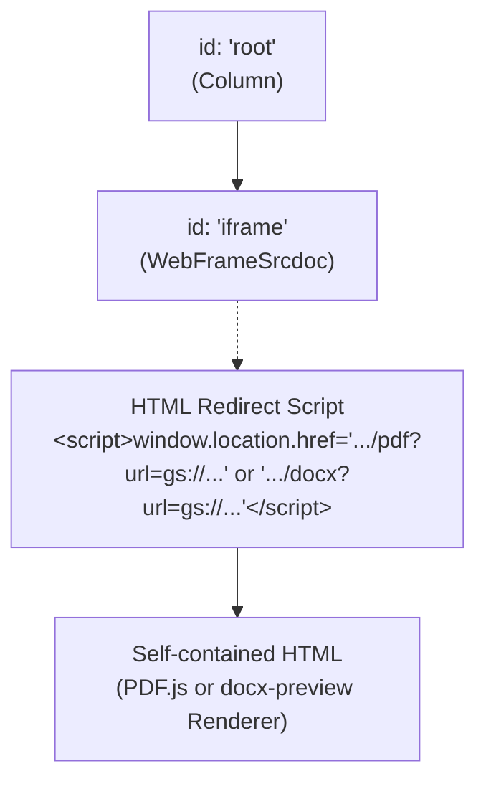

# A2UI Document Viewer Agent

A shippable, production-ready ReAct agent built on the [A2A Protocol](https://a2a-protocol.org/) to securely retrieve and render Google Cloud Storage (GCS) PDF and Microsoft Word (*.docx) documents inside Gemini Enterprise or local tester iframe environments.

---

## 🛠️ Configuration & Setup

To deploy this agent in your own Google Cloud environment, you only need to configure your Project ID.

### 1. Set Google Cloud Project ID
Open [deployment/terraform/single-project/vars/env.tfvars](file:///usr/local/google/home/hmp/src/a2ui-doc-viewer/deployment/terraform/single-project/vars/env.tfvars) and replace the default value with your own project ID:
```hcl
# Your Google Cloud project id
project_id = "your-gcp-project-id"
```

### 2. Configure GCP CLI
Authenticate and set your active project in the terminal:
```bash
gcloud auth login
gcloud config set project your-gcp-project-id
```

---

## 🚀 How to Run & Deploy

### Local Development (Tester Panel)
You can run a local mock server and web UI to interact with and test the agent:
```bash
# Start the local server
uv run python local_tester/server.py
```
Open your browser to `http://localhost:8000`. You can ask the agent:
> *"show me gs://hcls-ge-documents/roi_2025_health.pdf"* or *"show me the document gs://ge-demo-docs/atest.docx"*

### Deployment to GCP Cloud Run
Deploy the agent and configure it automatically using the `agents-cli`:
```bash
agents-cli deploy --project your-gcp-project-id
```

---

## 🧠 Architecture & How it Works

The A2UI Document Viewer Agent integrates the Gemini Large Language Model, Google Cloud Storage, and client-side iframe sandboxing.



### A2UI Component Hierarchy
The UI layout constructed by the agent is structured as a component tree:


### 1. The ReAct Agent Loop
- The agent is defined in [app/agent.py](file:///usr/local/google/home/hmp/src/a2ui-doc-viewer/app/agent.py).
- When a user asks to view a GCS document, the agent parses the prompt, extracts the GCS URI (e.g. `gs://bucket-name/path/to/document.pdf` or `gs://bucket-name/path/to/document.docx`), and constructs an absolute proxy URL pointing to `/pdf?url=gs://...` or `/docx?url=gs://...` on its own service host.
- The agent outputs a `WebFrameUrl` component, which the ADK framework automatically converts into a `WebFrameSrcdoc` containing a script redirecting to the proxy endpoint.

### 2. Bypassing Chrome's Iframe Sandbox Plugin Blockage
- In Gemini Enterprise, extensions and interactive panels are loaded inside a **sandboxed iframe** with strict security properties.
- Chrome's sandboxing blocks standard PDF or Word plugins from initializing inside sandboxed contexts. Attempting to load a raw file directly inside the iframe is blocked by the browser.
- To bypass this limitation, the agent's `/pdf` and `/docx` endpoints (in [app/fast_api_app.py](file:///usr/local/google/home/hmp/src/a2ui-doc-viewer/app/fast_api_app.py) and [local_tester/server.py](file:///usr/local/google/home/hmp/src/a2ui-doc-viewer/local_tester/server.py)):
  1. Base64-encodes the GCS PDF/Word document bytes.
  2. Embeds the base64 string directly into a self-contained HTML page that loads **PDF.js** (for PDF) or **docx-preview** (for Word documents) via CDN.
  3. Returns `text/html` instead of the original raw mime types.
- Because standard HTML and scripts are fully allowed inside the sandbox (`allow-scripts`), the browser renders the HTML page, and the client-side renderer decodes and renders the document layout.

### 3. Local Environment SSL Conflict Fallback
- In certain local development environments, concurrent calls to the Gemini LLM (via gRPC/HTTPS) and GCS SDK (via HTTPS) can cause `pyOpenSSL` certificate context collisions (`Context has already been used to create a Connection`).
- The local server [local_tester/server.py](file:///usr/local/google/home/hmp/src/a2ui-doc-viewer/local_tester/server.py) has a built-in safety fallback: if the GCS SDK client fails due to an SSL mutation conflict, it falls back to calling the system's `gcloud storage cat` command in a separate process space, ensuring reliable local testing.

---

## 📂 Project Structure

```
a2ui-doc-viewer/
├── app/
│   ├── agent.py               # Main agent definition & instructions
│   ├── fast_api_app.py        # Cloud Run FastAPI server & /pdf endpoint
│   └── app_utils/             # Telemetry & helper modules
├── local_tester/
│   ├── server.py              # Local FastAPI runner with fallback CLI execution
│   └── index.html             # Local mock UI rendering client-side A2UI components
├── deployment/
│   └── terraform/             # Terraform infrastructure config
├── tests/                     # Unit & integration tests
├── pyproject.toml             # Project dependency definitions
└── agents-cli-manifest.yaml   # Manifest for cloud deployments
```

---

## 🛠️ Development & Commands

| Command | Description |
|---|---|
| `agents-cli install` | Install dependencies using `uv` |
| `agents-cli playground` | Launch interactive development prompt loop |
| `uv run pytest tests/unit tests/integration` | Run unit and integration tests |
| `agents-cli deploy` | Deploy the agent service to Cloud Run |
